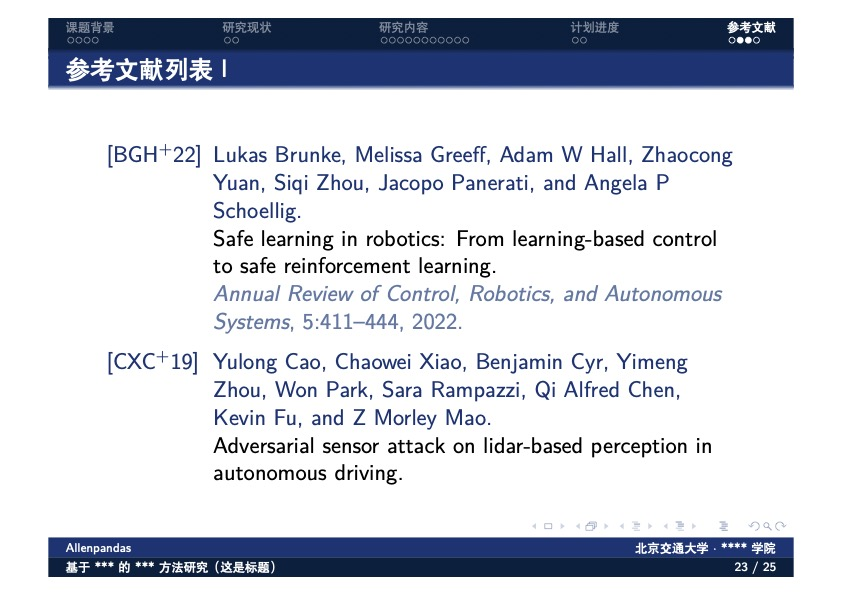

# BJTU-Beamer-Theme
北京交通大学LaTeX生成PDF的主题模板 | BJTU-Beamer-Theme

本Beamer主题模板最初参考了[清华大学Beamer主题模板](https://github.com/tuna/THU-Beamer-Theme)，后在该模板的基础上修改了主题配色、增加了部分代码的使用说明，例如："章"、"节"、"小节"的使用，增加了表格的title，增加了北京交通大学的校徽（标量图），在分栏页中增加了文字与图片的配合使用方法，增加了英文的参考文献以及引用的代码等。

欢迎各位BJTU的小红果儿们提Issue，为本仓库提出宝贵的意见；欢迎大家watch、star⭐️、folk、follow。

本仓库地址：https://github.com/Allenpandas/BJTU-Beamer-Theme

**关于Latex的教程，可以参考下面的的链接：**

- 清华大学 TUNA 协会的[《如何使用LaTeX论文排版系统》](https://tuna.moe/event/2018/latex/)：这是原仓库作者分享的链接。
- 北京交通大学的[《博士、硕士学位论文撰写规范及模板》](https://gs.bjtu.edu.cn/cms/item/195.html)：里面有LaTeX单面、双面的模板，可供大家参考使用。
- CSDN的[《LaTeX教程》](https://blog.csdn.net/m0_38068876/category_10779337.html)：作者整理了LaTeX中字号设置、特殊字符、表格、插图、数学公式的用法，能够满足轻度使用者们的日常所需。

**下面是本主题的效果图：**

